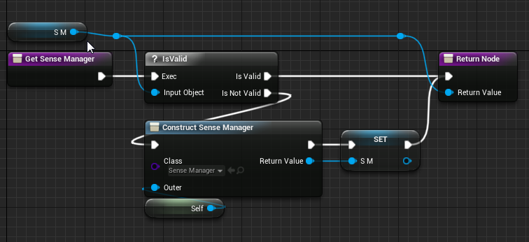
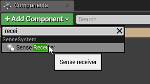
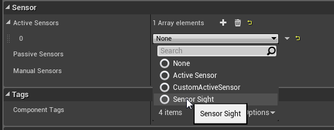
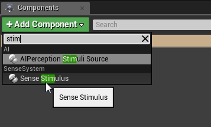
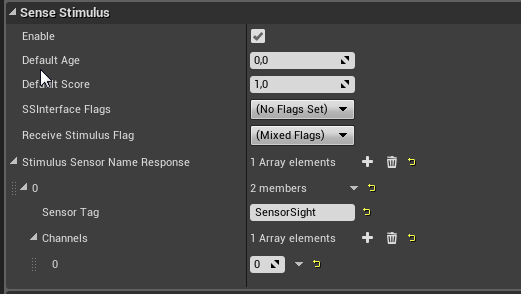
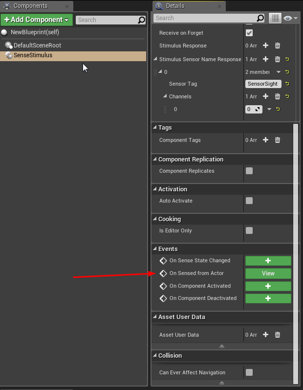
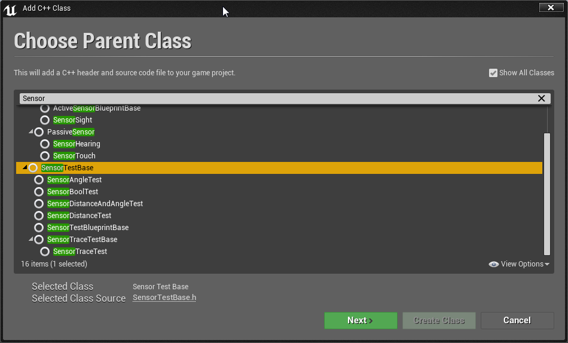

# Quick start

- 1. [SenseManager for UE4.21 and lower](#1-sensemanager-for-ue421-and-lower)
- 2. [SenseReceiverComponent](#2-sensereceivercomponent)
- 3. [SenseStimulusComponent](#3-sensestimuluscomponent)
- 4. [Implement Interface](#4-implement-interface)
- 5. [Customization Sensor and SensorTest in Blueprint](#5-customization-sensor-and-sensortest-in-blueprint)
- 6. [Customization SensorTest in Cpp](#6-customization-sensortest-in-cpp)
- 7. [Customization Sensorin Cpp](#7-customization-sensor-and-sensortest-in-cpp)
- 8. [DebugDraw](#8-debugdraw) # todo
- 9. [Profiling](#9-profiling) # todo

## 1. SenseManager for UE4.21 and lower

First, where to start: SenseManager implementation required. The current implementation prior to
UE4.22 uses GameInstance as the owner of the SenseManager object. With UE4.22, SenseManager is
implemented as a GameInstanceSubSystem, and no action is required to create it.

Create an object from the SenseManager class and save it into a variable:


Next, you need to implement the SenseManagerInterface,
getter interface


add a single function implementation using one of the described methods
**Get Sense Manager** ( USenseManager* **GetSenseManager** ())
Which returns a pointer to a **SenseManager object**



This completes the operation with the GameInstance setup.

## 2. SenseReceiverComponent

add to actor Sense Receiver Component



add sensors to component



adjust the parameters of the sensor, in particular the received channels on which corresponds to
the stimulus


## 3. SenseStimulusComponent

Add to detectable actor Sense Stimulus Component



add the required sensor tag



Add any implementation in the receiver or stimulus to the necessary events.
eg:



All that remains is to add or spawn actors on the level.

## 4. Implement Interface


See [section 3](./sensesystem-pdf.md#3-sensesystem-architecture).

## 5. Customization Sensor and SensorTest in Blueprint



See an example in:
**SenseSysExample\Content\ExampleCustomization\CustomActiveSensor.uasset
SenseSysExample\Content\ExampleCustomization\CustomSensorTest_Location.uasset**

## 6. CustomSensorTest

A special class has been allocated for blueprints: **SensorTestBlueprintBase**
there are three functions available for redefinition..
- 1. **GetReadyToTest** - Preparing the sensor for the test
  - a. **Ready** - sensor ready for test
  - b. **Skip** - the sensor will skip the test
  - c. **Fail** - an error occurred while preparing the test,the results will be reset, and the test itself will be skipped, a message will be displayed in the log.
- 2. **RunTest** - implementation of the test itself, if thesensor is configured to call not in the game stream,
then it is forbidden to call thread-unsafe functions in the method
  - a. input parameters:
    - * **StimulusComponent** - SenseStimulusComponent
    - * **Location** - Object location
    - * **CurrentScore** - current score
  - b. output parameters:
    - * **Score** - score after test
    - * **ESenseTestResult**
        - 1. **Sensed** - detection was successful
        - 2. **NotLost** - detection failed but the object will notbe lost if it was previously detected
        - 3. **Lost** - detection failed
 - 3. Initialize - implementation of initialization


## 7. CustomSensor

It makes sense to create a custom sensor when it has a unique set of tests, or unique actions. All
classes are available for blueprint inheritance.

## 8. Customization Sensor and SensorTest in Cpp

See an example in:

```
SenseSysExample\Source\SenseSysExample\Public\MyCustomSensorTest.h
SenseSysExample\Source\SenseSysExample\Public\MyCustomActiveSensor.h
```
